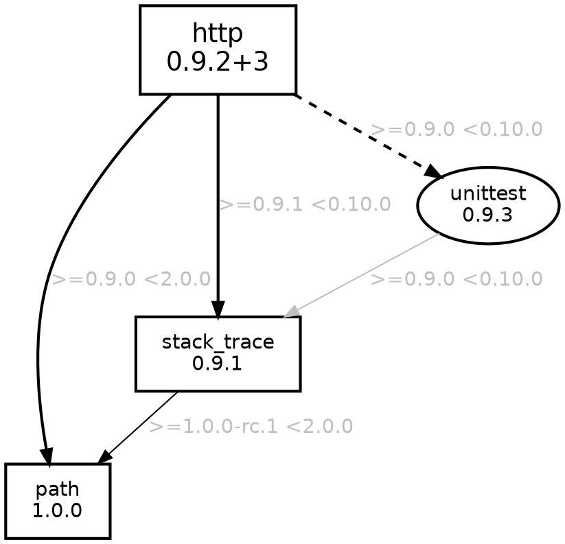

### Visualize package dependencies in your Dart project

[](https://pub.dev/packages/pubviz)
[](https://pub.dev/packages/pubviz/publisher)
[](https://github.com/kevmoo/pubviz/actions?query=workflow%3ACI+branch%3Amaster)

*Make sure you run `pub get` or `pub upgrade` in your target project directory.*

### Example

Here's an [example](https://kevmoo.github.io/pubviz/) of `pubviz` run on itself.

### Installing

Activate `pubviz`.
```console
$ dart pub global activate pubviz
```

### Use

If you have [configured your PATH correctly][path], you can run `pubviz`
directly.

```console
$ pubviz
```

Otherwise, you can use the `pub global` command.

```console
$ dart pub global run pubviz
```

### Generate and open an html file for the package on the current path.

```console
$ pubviz open
```

Should open your default browser to something like:


### Print GraphViz dot format to command line for a package on a specified path.

```console
$ pubviz --format=dot print /path/to/http_package
```

You should see output something like:



### Generate PDF, PNG and other files

[GraphViz](https://graphviz.org/about/) tool allows dot format to be converted to various types of outputs like PNG, PDF or SVG. 

In order to export `pubviz` data to PNG file you need to install GraphViz package on your machine ([see detailed installation instructions](https://graphviz.org/doc/info/output.html)). 

On macOS:

```sh
brew install graphviz
```

On Windows:

```sh
winget install graphviz
```

Then you can save the `pubviz` output to a file and convert it with `dot` command to desired output type, e.g.:

```sh
pubviz --format=dot print > output.dot
dot -Tpdf output.dot -o output.pdf
```

The full list of possible output types is available on [the GraphViz website](https://graphviz.org/doc/info/output.html).

### `pubviz -?` prints help

```console
$ pubviz -?
Usage: pubviz [<args>] <command> [<package path>]

Commands:
  open   Populate a temporary file with the content and open it.
  print  Print the output to stdout.

Arguments:
  -f, --format=<format>
            [dot]                  Generate a GraphViz dot file
            [html] (default)       Wrap the GraphViz dot format in an HTML template which renders it.

  -i, --ignore-packages            A comma separated list of packages to exclude in the output.
  -o, --[no-]flag-outdated         Check pub.dev for lasted packages and flag those that are outdated.
  -d, --direct-dependencies        Include only direct dependencies.
  -p, --production-dependencies    Include only production (non-dev) dependencies.
  -v, --version                    Print the version of pubviz and exit.
  -?, --help                       Print this help content.

If <package path> is omitted, the current directory is used.
```

[path]: https://dart.dev/tools/pub/cmd/pub-global#running-a-script-from-your-path
