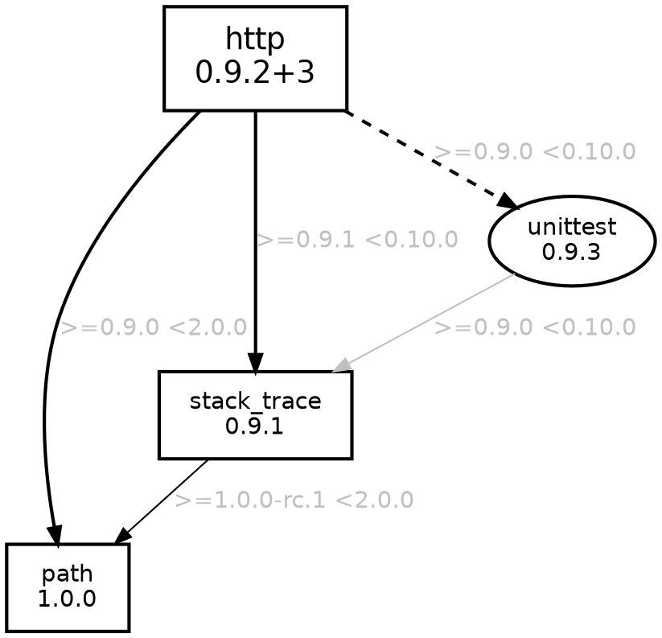

### Visualize package dependencies in your Dart project

[](https://travis-ci.org/kevmoo/pubviz)
[](https://coveralls.io/r/kevmoo/pubviz)

*Make sure you run `pub get` or `pub upgrade` in your target project directory.*

### Example

Here's an [example](http://kevmoo.github.io/pubviz/) of `pubviz` run on itself.

### Installing

Activate `pubviz`.
```console
$ pub global activate pubviz
```

### Use

If you have [configured your PATH correctly][path], you can run `pubviz`
directly.

```console
$ pubviz
```

Otherwise you can use the `pub global` command.

```console
$ pub global run pubviz
```

### Generate and open an html file for the package on the current path.

```console
$ pubviz open
```

Should open your default browser to something like:


### Print GraphViz dot format to command line for a package on a specified path.

```console
$ pubviz --format=dot print /path/to/http_package
```

You should see output something like:



### pubviz with no arguments prints help

```console
$ pubviz -?
Usage: pubviz [<args>] <command> [<package path>]

Commands:
  open   Populate a temporary file with the content and open it.
  print  Print the output to stdout.

Arguments:
  -f, --format=<format>
            [dot]             Generate a GraphViz dot file
            [html]            Wrap the GraphViz dot format in an HTML template which renders it.

  -i, --ignore-packages       A comma seperated list of packages to exclude in the output.
  -o, --[no-]flag-outdated    Check pub.dartlang.org for lasted packages and flag those that are outdated.
  -?, --help                  Print this help content.

If <package path> is omitted, the current directory is used.
```

[path]: https://www.dartlang.org/tools/pub/cmd/pub-global.html#running-a-script-from-your-path
