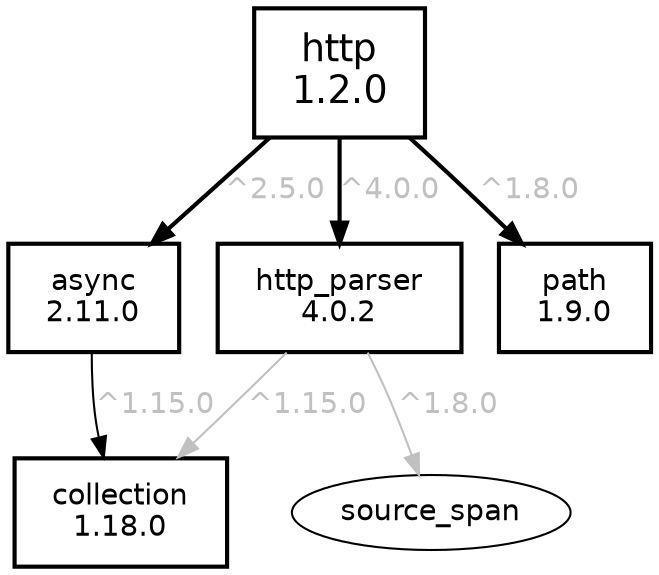

### Visualize package dependencies in your Dart project

[](https://pub.dev/packages/pubviz)
[](https://pub.dev/packages/pubviz/publisher)
[](https://github.com/kevmoo/pubviz/actions/workflows/ci.yml)

*Make sure you run `dart pub get` or `dart pub upgrade` in your target project directory.*

### Example

Here's an [example](https://kevmoo.github.io/pubviz/) of `pubviz` run on itself.

### Installing

Activate `pubviz`.
```console
$ dart pub global activate pubviz
```

### Use

If you have [configured your PATH correctly][path], you can run `pubviz`
directly.

```console
$ pubviz
```

Otherwise, you can use the `pub global` command.

```console
$ dart pub global run pubviz
```

### Generate and open an HTML file for the package on the current path.

```console
$ pubviz
```

Should open your default browser to something like:


### Print GraphViz dot format to command line for a package on a specified path.

```console
$ pubviz -a print /path/to/http_package
```

You should see output something like:


```dot
digraph G {
  node [fontname=Helvetica];
  edge [fontname=Helvetica, fontcolor=gray];

  http [label="http
1.2.0",fontsize=18,style=bold,shape=box,margin="0.25,0.15"];
  http -> async [label="^2.5.0",penwidth=2];
  http -> http_parser [label="^4.0.0",penwidth=2];
  http -> path [label="^1.8.0",penwidth=2];

  async [label="async
2.11.0",shape=box,margin="0.25,0.15",style=bold];
  async -> collection [label="^1.15.0"];

  collection [label="collection
1.18.0",shape=box,margin="0.25,0.15",style=bold];

  http_parser [label="http_parser
4.0.2",shape=box,margin="0.25,0.15",style=bold];
  http_parser -> collection [label="^1.15.0",color=gray];
  http_parser -> source_span [label="^1.8.0",color=gray];

  path [label="path
1.9.0",shape=box,margin="0.25,0.15",style=bold];
}
```

### Generate PDF, PNG and other files

[GraphViz](https://graphviz.org/about/) tool allows dot format to be converted to various types of outputs like PNG, PDF or SVG. 

In order to export `pubviz` data to PNG file you need to install GraphViz package on your machine ([see detailed installation instructions](https://graphviz.org/doc/info/output.html)). 

On macOS:

```sh
brew install graphviz
```

On Windows:

```sh
winget install graphviz
```

Then you can save the `pubviz` output to a file and convert it with `dot` command to desired output type, e.g.:

```sh
pubviz -a print > output.dot
dot -Tpdf output.dot -o output.pdf
```

The full list of possible output types is available on [the GraphViz website](https://graphviz.org/doc/info/output.html).

### `pubviz -?` prints help

```console
$ pubviz -?
Usage: pubviz [<args>] [<package path>]

Arguments:
  -a, --action=<action>
            [create]               Generate the HTML web app in a directory.
            [open] (default)       Like "serve" but also opens the browser.
            [print]                Print the raw DOT output to stdout.
            [serve]                Like "create" but also hosts the app on a local server.

  -i, --ignore-packages            A comma separated list of packages to exclude in the output.
  -o, --[no-]flag-outdated         Check pub.dev for latest packages and flag those that are outdated.
      --out-dir                    A directory to write the generated HTML file and its localized assets. (HTML format only)
  -d, --direct-dependencies        Include only direct dependencies.
  -p, --production-dependencies    Include only production (non-dev) dependencies.
  -v, --version                    Print the version of pubviz and exit.
  -w, --[no-]workspace             Include all packages in the workspace.
  -?, --help                       Print this help content.

If <package path> is omitted, the current directory is used.
```

[path]: https://dart.dev/tools/pub/cmd/pub-global#running-a-script-from-your-path
